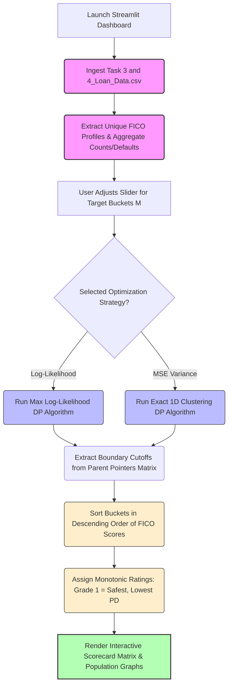

# FICO-Score-Strategic-Quantization-Engine
 This application leverages a Dynamic Programming  backend to solve the 1D optimization problem of continuous-to-categorical credit score mapping , producing an auditable rating scale where a lower rating strictly maps to stronger creditworthiness (lower Probability of Default).
# FICO Score Strategic Quantization Engine 🎯

An automated quantitative risk tool built for the retail banking and mortgage credit teams. This application leverages a **Dynamic Programming (DP)** backend to solve the $1\text{D}$ optimization problem of continuous-to-categorical credit score mapping (quantization), producing an auditable rating scale where a lower rating strictly maps to stronger creditworthiness (lower Probability of Default).

---

## 📌 Project Background

When modeling credit risk for long-term assets like mortgages, traditional scoring variables such as continuous FICO scores ($300$ to $850$) can exhibit high local volatility or require non-linear feature architectures. Charlie's classification model requires stable, categorical bucket labels rather than sparse, multi-integer variables.

This repository provides an algorithmic engine that avoids arbitrary manual bucketing (such as choosing rounded intervals like 600 or 700 by guesswork) and replaces it with mathematical optimization based on historical default density or population variance.

---

## 🧮 Quantitative Optimization Strategies

This pipeline provides two distinct mathematical frameworks to segment credit profiles:

### 1. Log-Likelihood Maximization (Risk Profiling)
This framework groups borrowers by maximizing the historical contrast of default behavior across bins. The objective function optimized via dynamic programming is:

$$\mathcal{L}(b) = \sum_{i=1}^{M} \left[ k_i \ln(p_i) + (n_i - k_i) \ln(1 - p_i) \right]$$

Where:
* $M$ = Target number of rating buckets chosen by the user.
* $n_i$ = Total borrower population contained within bucket $i$.
* $k_i$ = Observed defaults within bucket $i$.
* $p_i = \frac{k_i}{n_i}$ = Empirical Probability of Default ($\text{PD}$) of bucket $i$.

### 2. Mean Squared Error (MSE) Minimization (Population Clustering)
This approach minimizes the variance within each continuous FICO segment, treating the task as a globally optimal $1\text{D}$ clustering routine:

$$\text{MSE}(b) = \sum_{i=1}^{M} \sum_{j \in \text{Bucket } i} (x_j - \mu_i)^2$$

Where $x_j$ represents an individual borrower's FICO score and $\mu_i$ represents the mean score of their assigned bucket.

---

## 🔄 System Architecture Workflow

The dashboard handles data processing, dynamic programming mapping, and boundary extraction sequentially:

##  Author

**Tirthabrata Das**

* GitHub: https://github.com/tirthabrata0407-cloud
* LinkedIn: https://www.linkedin.com/in/tirthabratadas2001/
